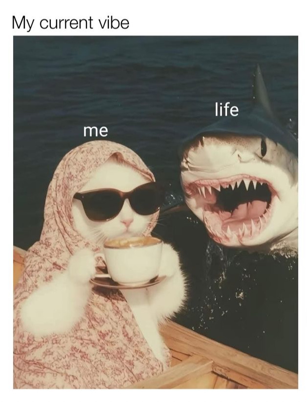

<body>

 <em> Posted on</em> 28 December, 2024 

</body>

</body>

In this quiet pause before the rush, I'm grounding myself on what brought me here, from the highs to the lows. This year has been a wild ride. All of a sudden I found myself in a small town across the border from Toronto, my second home. The move was indeed deliberate, yet it took a while for the reality to sink in. 
  
Life moves fast.
  
2024 taught me important lessons: 
  

<body> 

  
	<b> Don't sacrifice your peace of mind to please others.</b> Learning to set boundaries and put yourself first without guilt is well worth it.

</body> 

<body> 

  
  <b> Don't take unsolicited advice.</b> Oftentimes the advice-givers either have a humongous sense of self or a desire to keep you from achieving your full potential.

</body> 

<body> 

  
  <b> Stand up for yourself and others.</b> Use your voice wisely, and don't let the bullies (yes, they do exist in academia!) oppress it so you can retain the right and the ability to make your voice heard in the future.

</body> 

I'm thankful from the bottom of my heart for all of those who've held me accountable, taught me how to deal with difficult people in a professional manner, and supported me in your unique ways throughout this year and henceforth. Here's to holding space for what matters most.

<figure>
    
    <figcaption>Cheers to 2025</figcaption>
</figure>

